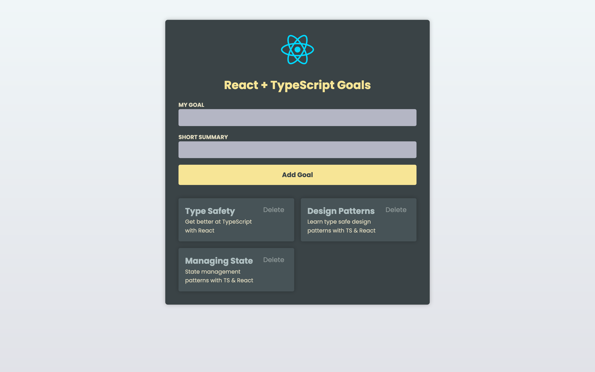
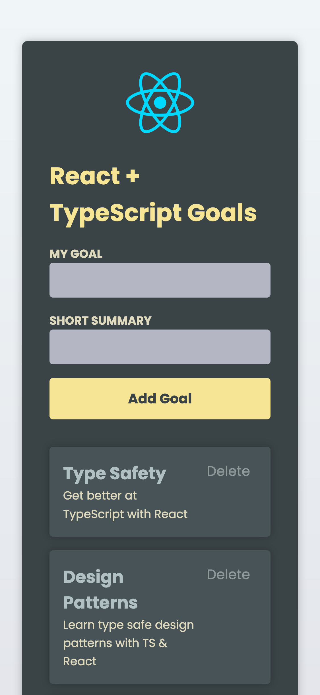

# Goal Tracker

A clean, minimalist web application for tracking personal or professional goals built with Vite, React, TypeScript, and CSS.



## Table of Contents

- [Goal Tracker](#goal-tracker)
  - [Table of Contents](#table-of-contents)
  - [Features](#features)
  - [Technologies Used](#technologies-used)
  - [Getting Started](#getting-started)
    - [Prerequisites](#prerequisites)
    - [Installation](#installation)
  - [Build for Production](#build-for-production)
  - [Project Structure](#project-structure)
  - [Future Enhancements](#future-enhancements)
  - [Contributing](#contributing)

## Features

- Create and track goals with a simple, intuitive interface
- Delete completed goals with a single click
- Responsive design works on both desktop and mobile devices



## Technologies Used

- [Vite](https://vitejs.dev/) - Next generation frontend tooling
- [React](https://reactjs.org/) - JavaScript library for building user interfaces
- [TypeScript](https://www.typescriptlang.org/) - Typed JavaScript for better developer experience
- CSS - Custom styling with modern CSS techniques

## Getting Started

### Prerequisites

- Node.js (v14.0.0 or higher)
- npm or yarn

### Installation

1. Clone the repository

```bash
git clone https://github.com/yourusername/goal-tracker.git
cd goal-tracker
```

2. Install dependencies

```bash
npm install
# or
yarn
```

3. Start the development server

```bash
npm run dev
# or
yarn dev
```

4. Open your browser and navigate to `http://localhost:5173`

## Build for Production

```bash
npm run build
# or
yarn build
```

The build artifacts will be stored in the `dist/` directory.

## Project Structure

```
goal-tracker/
├── public/
├── src/
│   ├── App.tsx
│   ├── assets/
│   ├── components/
│   ├── index.css
│   ├── main.tsx
│   └── vite-env.d.ts
├── tsconfig.app.json
├── tsconfig.json
├── tsconfig.node.json
└── vite.config.ts
```

## Future Enhancements

- Categories for different types of goals
- Priority levels for goals
- Due dates and reminders
- Dark mode support

## Contributing

Contributions are welcome! Please feel free to submit a Pull Request.
